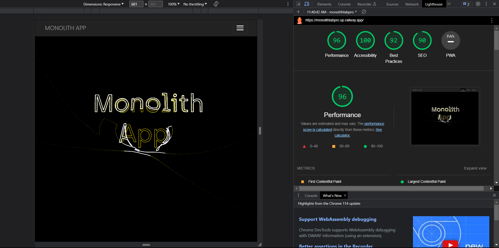
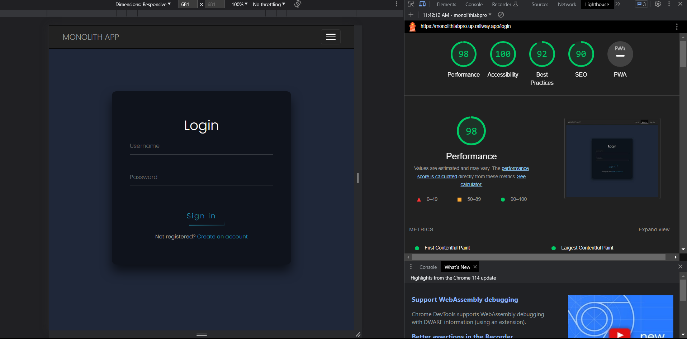
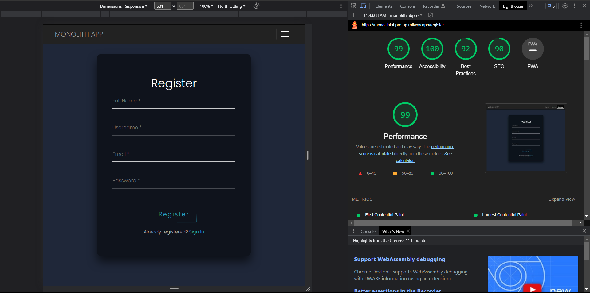
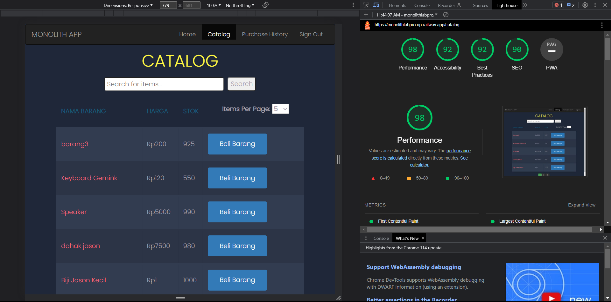
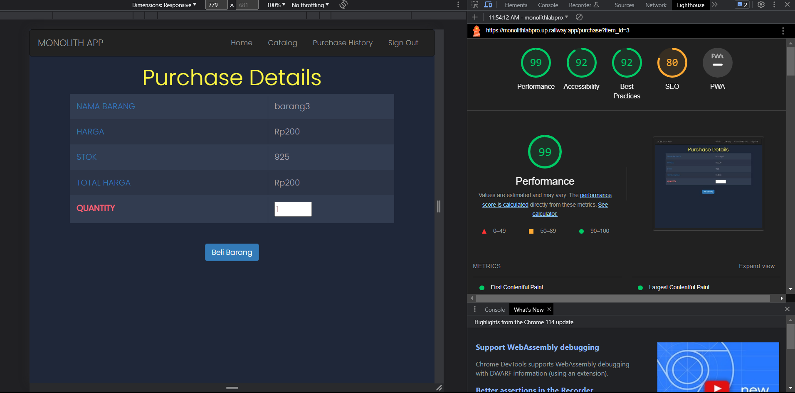
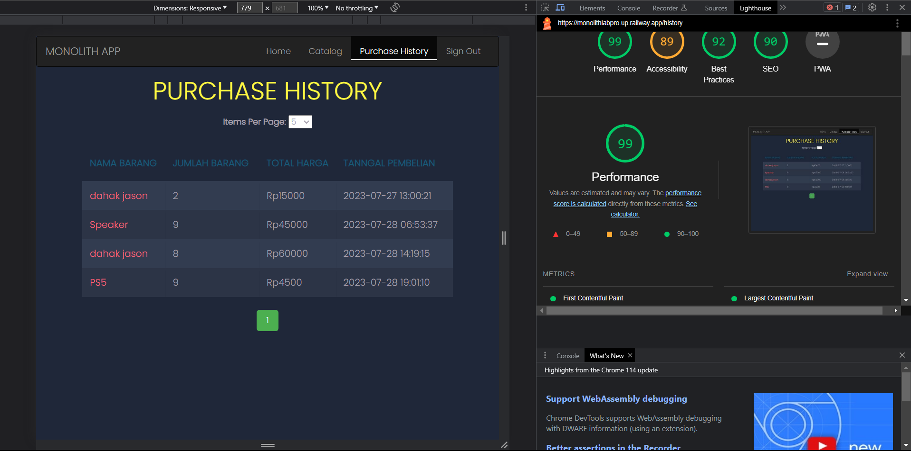
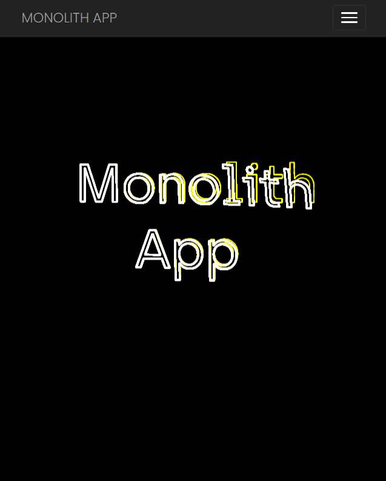
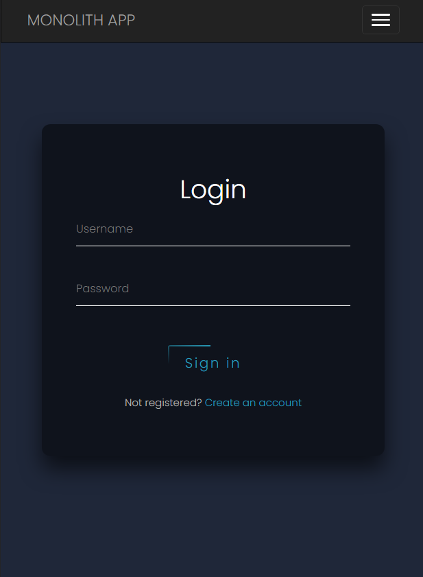
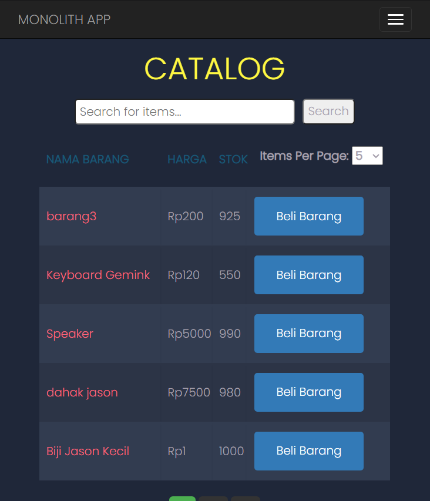
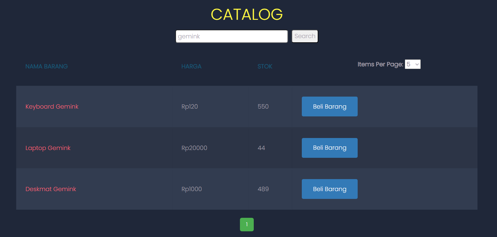

# Seleksi 3 Labpro - Monolith Service

## 13521024 - Ahmad Nadil

## How to Run
### Run using php
#### 1. Make sure you have laravel installed
#### 2. Install the dependencies for the laravel project
```
composer install
```

#### 3. Copy the .env.example file and rename it to .env and change the following environment variables to your own
```
DB_CONNECTION=
DB_HOST=
DB_PORT=
DB_DATABASE=
DB_USERNAME=
DB_PASSWORD=
BE_URL=
```

#### 4. Migrate the database if you haven't
```
php artisan migrate
```

#### 5. Serve the project
```
php artisan serve
```

#### 6. The project will be served on port 127.0.0.1:8000
```
http://127.0.0.1:8000/
```

### Run using Docker
#### 1. Make sure you have docker installed
#### 2. Run the docker-compose
```
docker-compose up
```

#### 3. Migrate the database if you haven't
```
docker-compose exec php php artisan migrate
```

#### 4. The project will be served on localhost
```
localhost
```

## Design Pattern yang Digunakan
### 1. Singleton
Singleton digunakan untuk menginisialisasi navbar yang akan digunakan di setiap halaman. Singleton digunakan agar navbar yang digunakan di setiap halaman adalah navbar yang sama. Lalu, singleton juga digunakan dalam menginisialisasi database connection agar database connection yang digunakan adalah database connection yang sama dan tabel database User dan History hanya terinstansiasi sekali.

### 2. Model-View-Controller (MVC) Pattern
MVC digunakan untuk memisahkan antara logic, view, dan controller. Model adalah tempat untuk menyimpan data, view adalah tempat untuk menampilkan data, dan controller adalah tempat untuk mengatur logic. MVC digunakan agar logic, view, dan controller dapat diubah secara terpisah tanpa mengganggu yang lainnya. Contohnya adalah ketika ingin mengubah tampilan dari halaman login, kita hanya perlu mengubah file view login.blade.php tanpa perlu mengubah logic dan controller yang ada.

### 3. Repository Pattern
Repository pattern digunakan untuk memisahkan logic yang berhubungan dengan database dengan logic yang berhubungan dengan business logic. Repository pattern digunakan agar logic yang berhubungan dengan database dapat diubah tanpa mengubah logic yang berhubungan dengan business logic. Contohnya adalah ketika ingin mengubah sumber database, kita hanya perlu mengubah .env file tanpa perlu mengubah logic yang ada.

## Technology Stack yang Digunakan
- PHP version 8.2.4
- Laravel version 10.16.1
- MariaDB version 10.5.12
- Docker version 20.10.24

## Endpoint yang dibuat
- GET / : Home page
- GET /login : Login page
- GET /register : Register page
- GET /purchase : Purchase page
- GET /history : History page
- GET /catalog : Catalog page
- GET /logout : Process logout
- POST /process_register : User registration process
- POST /process_login : User login process
- POST /process_purchase : Purchase process

## Bonus
### B02 - Deployment
Aplikasi ini sudah di-deploy menggunakan railway 

https://monolithlabpro.up.railway.app/

### B04 - Polling
Aplikasi ini menggunakan polling untuk mengecek apakah ada barang yang baru atau history yang baru. Polling dilakukan setiap 10 detik sekali. Polling dilakukan dengan menggunakan javascript.

### B05 - Lighthouse
1. Home Page

    

2. Login Page

    

3. Register Page

    

4. Catalog Page

    

5. Purchase Page

    

6. History Page

    

### B06 - Responsive Layout
Aplikasi yang dibuat sudah responsive, navbar akan berubah menjadi hamburger menu ketika layar berukuran kecil.

<p align = "center">
    
</p>

<p align = "center">
    
</p>

<p align = "center">
    
</p>

### B11 - Search Feature
Aplikasi yang dibuat sudah memiliki fitur search. Fitur search ini dapat digunakan untuk mencari barang yang diinginkan. Fitur search ini akan mencari barang yang memiliki nama yang mengandung kata yang diinputkan.

<p align = "center">
    
</p>